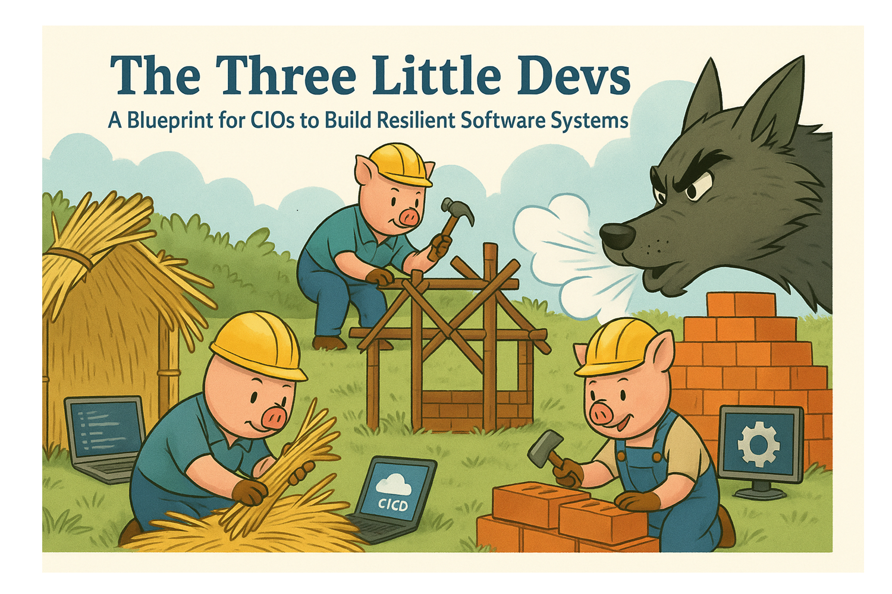

# The Three Little Devs: A Blueprint for CIOs to Build Resilient Software Systems

As someone who’s spent decades in the tech industry, coding multiple late nights, I’ve seen what makes software succeed—and what makes it fail spectacularly. Let’s reframe the timeless story of the Three Little Pigs as a lesson for today’s IT leaders. In this version, the pigs are engineers building software systems, and the big bad wolf is the inevitable crisis—be it a scalability failure, a security breach, a costly outage, or the talent crunch when you need to replace staff. The real issue, though, isn’t the wolf. It’s the hands-off CIO who lets their teams build with a chaotic mix of tools and languages, without standards or discipline, as if every choice from the vast universe of tech is equally valid. Here’s a structured, pragmatic take on how to fix this, grounded in the clarity and focus that drive great software.

## Pig One: The Straw Shortcut

Imagine the first pig: eager, fast-moving, but shortsighted. This is the engineer who grabs the easiest tools—straw, in our tale. Think of them downloading some unmaintained JavaScript package from NPM, tossing in a bit of Python 2.7 (yes, it still lingers in some corners), or jumping on the latest hyped-up language because it’s “disruptive.” They’re racing to deliver, and the CIO? They’re detached, focused on budgets or boardroom optics, not the tech stack. No mandated frameworks, no approved languages, no governance. “Let the team innovate,” the CIO says, mistaking freedom for leadership.

This straw approach mirrors shops that end up with a hodgepodge of 15 different languages and solutions—bits of Rust here, Elixir there, and a dozen others scattered like confetti. It might feel agile at first, but then the wolf arrives. Sometimes it’s a traffic surge from a Black Friday sale, huffing and puffing until the system collapses under incompatible dependencies and zero monitoring. Other times, it’s the talent wolf: when a key engineer leaves, good luck finding a replacement in the universe who knows all 15 of those niche skill sets. Recruiting drags on for months, costs skyrocket, and productivity tanks. Downtime or delays cost millions, customers churn, and the team scrambles. The lesson is clear: speed without structure is a recipe for disaster. A CIO’s job isn’t to micromanage but to set guardrails—clear, enforceable standards that prevent straw houses from being built in the first place.

## Pig Two: The Stick Compromise

The second pig learns a bit from the first’s failure. They choose sticks—better than straw, but still flimsy. This is the team that half-commits to standardization. Maybe they settle on a cloud platform like Azure (a solid choice, if I do say so), but let each microservice run wild: one in Node.js, another in Rust, a third in whatever the new hire used at their last startup. Tooling? A mix—some CI/CD with Azure DevOps, some with CircleCI, and that one legacy app still deployed via FTP. The CIO remains hands-off, championing “agility” without ensuring alignment. No enterprise-wide language policy, no vetted toolset, no architecture reviews to catch the cracks.

Again, this echoes organizations juggling a chaotic blend of 15 or more languages and tools, creating silos that seem efficient until reality bites. The wolf returns—this time, perhaps a zero-day exploit in an outdated library, huffing and puffing until a security breach leaks customer data and regulators circle. Or it’s the hiring wolf: staff turnover hits, and suddenly you’re scouring the globe for unicorns who master that exact mishmash of skills. Months of unfilled roles lead to burnout for the remaining team and stalled projects. Sticks are stronger than straw, but without a unified approach, they’re still vulnerable. A CIO who doesn’t enforce consistency is setting their team up for a costly, avoidable failure.

## Pig Three: The Brick Foundation

Now, the third pig—the one who gets it right. They build with bricks: a cohesive tech stack, say, C# or Java for the backend, containerized with Docker, orchestrated with Kubernetes, and backed by automated tests and observability tools like Application Insights. Every choice is deliberate, optimized for scalability, security, and maintainability. This isn’t about stifling creativity; it’s about building to last.

But here’s the catch: even the best engineers need leadership to scale their bricks across the organization. A strong CIO steps in with clear directives: “All new services use TypeScript for frontend. Infrastructure is defined with Terraform. Every project passes a security audit before deployment.” They invest in training, enforce code reviews, and maintain a curated list of approved tools. Without this, the third pig’s fortress stands alone, surrounded by the crumbling straw and sticks of less disciplined teams.

When the wolf comes—maybe a compliance audit, a massive data migration, or that talent shortage—the brick system holds firm. Hiring is smoother because the skills are standard and transferable; you’re not hunting for experts in 15 obscure techs. But if the broader ecosystem lacks standards, even this success is tainted by the chaos around it.

## The CIO’s Roadmap: Standards, Not Neglect

The data backs this up: studies like the 2023 State of DevOps Report show that high-performing teams thrive on standardized tooling and clear governance, delivering 30% faster with 50% fewer failures. Yet too many CIOs act like absentee landlords, leaving engineers to pick from an overwhelming array of tools—over 30,000 packages in NPM alone, thousands of languages, and countless cloud services. This isn’t empowerment; it’s abandonment, especially when the talent wolf strikes and you can’t replace staff without a massive skills mismatch.

CIOs, here’s your action plan:
1. **Define a Tech Stack**: Choose languages and frameworks that are battle-tested, like Python, Java, or C#, with strong ecosystems and community support. Document them. Enforce them to avoid the 15-language nightmare.
2. **Curate Tools**: Standardize on a CI/CD pipeline (e.g., Azure DevOps), infrastructure-as-code (e.g., Terraform), and monitoring solutions. Eliminate the “every team picks their own” chaos.
3. **Invest in Governance**: Set up architecture review boards, mandate code reviews, and audit regularly. Catch issues before they become outages or hiring headaches.
4. **Train and Align**: Upskill your teams on the chosen stack. Foster a culture of shared responsibility, not silos, so when turnover happens, replacements slot in seamlessly.

The wolf—be it a cyberattack, a traffic spike, a regulatory fine, or a staffing crisis—is always coming. Hands-off leadership builds straw and stick systems that collapse under pressure, leaving you vulnerable to both technical and human failures. Be the CIO who empowers with structure, who hands their engineers bricks and a blueprint. That’s how you build software that doesn’t just survive but thrives in the face of any storm. Let’s get to work.
